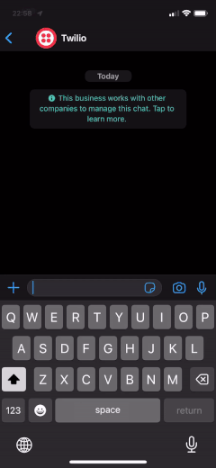

# Whatsapp ChatGPT

## Getting started

The prerequisites to running this applicaton are to have setup:

- A free Twilio account (with option to pay if preferred).
- An OpenAI account with billing information provided.

### Environment variables

Get the following variables at these locations:

- `TWILIO_ACCOUNT_SID` and `TWILIO_AUTH_TOKEN` at https://console.twilio.com/us1/account/keys-credentials/api-keys.
- `TWILIO_SEND_FROM` set to either your sandbox phone number or paid Twilio registered number. With country code extension.
- `TWILIO_SEND_TO` set to your personal phone number. With country code extension.
- `OPENAI_API_KEY` at https://platform.openai.com/account/api-keys

### Running locally

- Copy .env.example to .env and update the environment variables.
- To run locally, run `make run`
- To get the webhook events coming through, you must run `tunnel-webhook` that uses ngrok. Once it provides you a url, you must update the sandbox to point to it with the correct path, e.g. `https://xxxx-xx-xx-xxx-xxx.eu.ngrok.io/webhooks/twilio`.

### Deploying the app

After getting the correct environment variables, click one of the buttons above and input them when required. Alternatively you may build this docker image and push it to your hosting provider of choice.

In order to trigger the messages coming back, you must set the webhook url in Twilio with the correct path. You can set the webhook through the sandbox here: https://console.twilio.com/us1/develop/sms/try-it-out/whatsapp-learn. Examples of these are:

- `https://whatsapp-chatgpt-xxxxx.ondigitalocean.app/webhooks/twilio`
- `https://whatsapp-chatgpt-xxxxxxxxxx-uc.a.run.app/webhooks/twilio`
